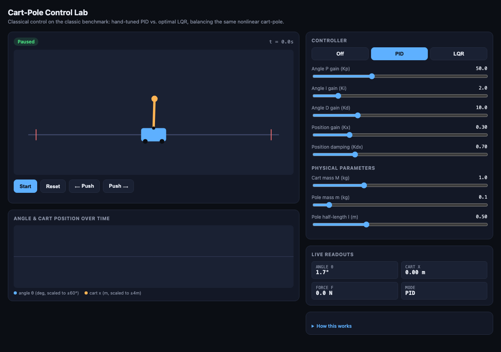
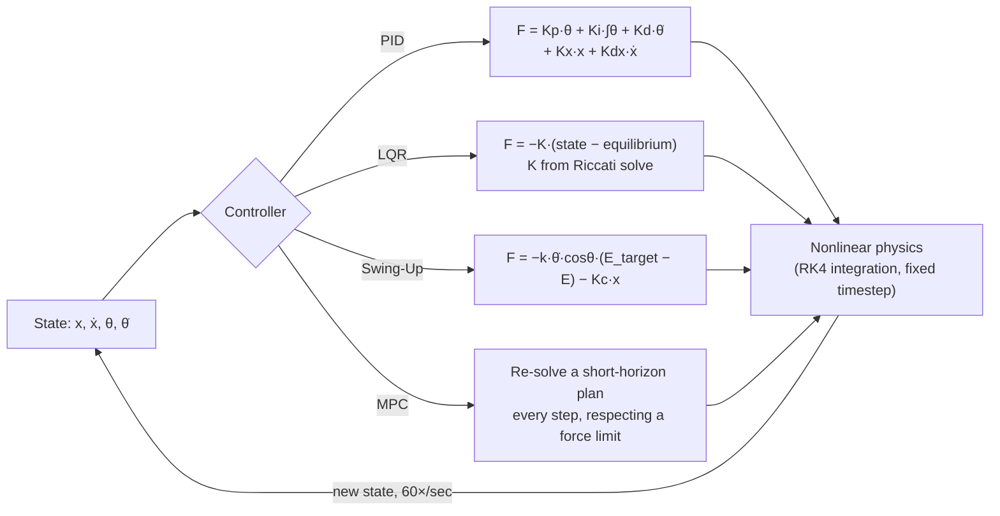
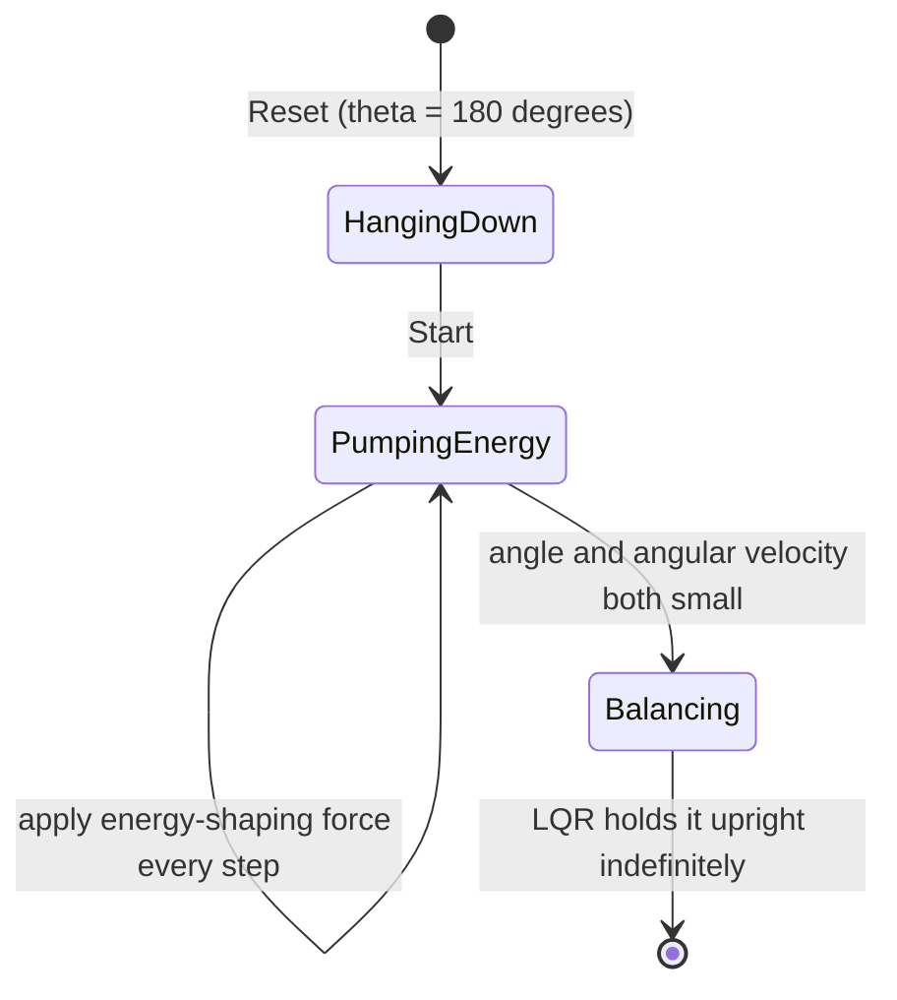
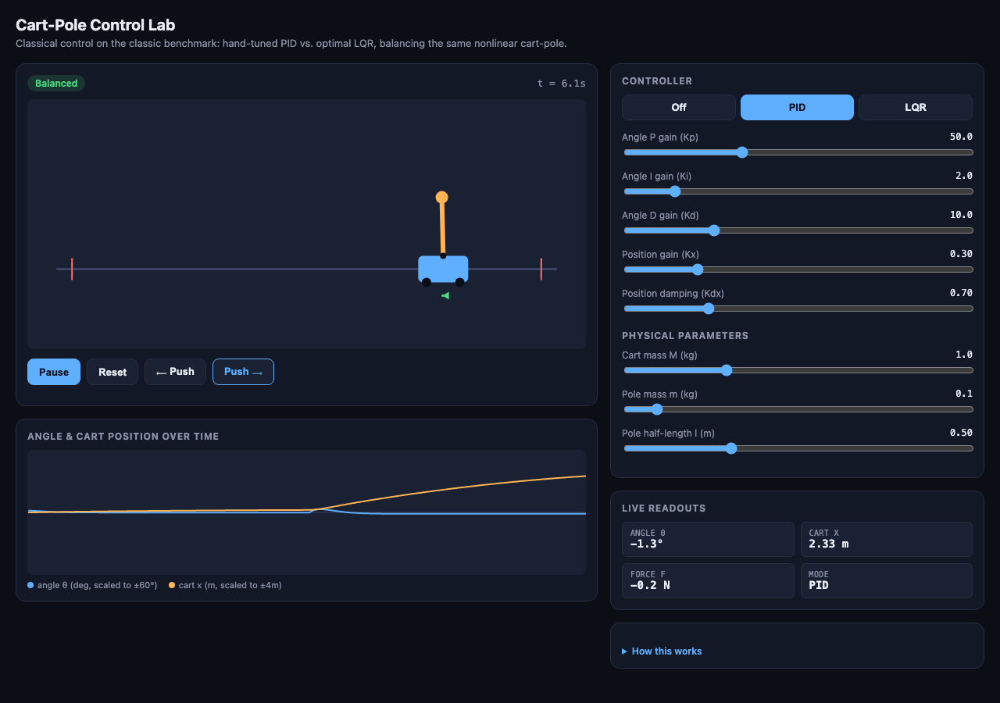
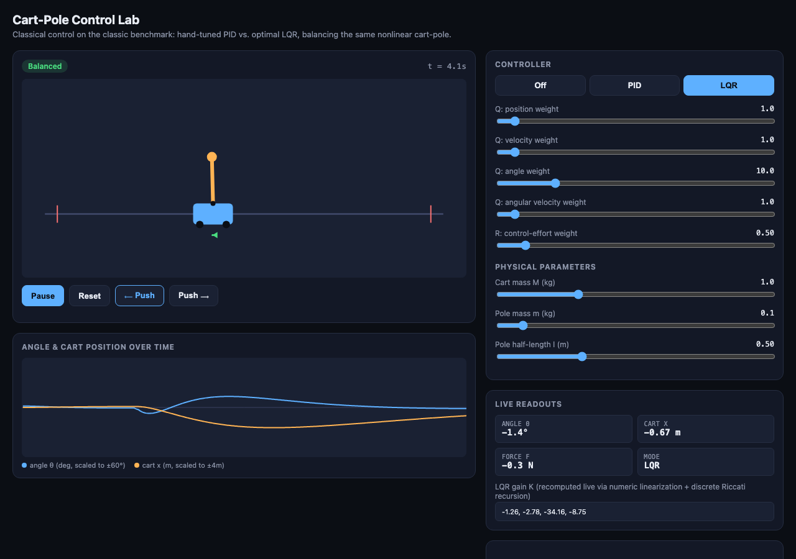
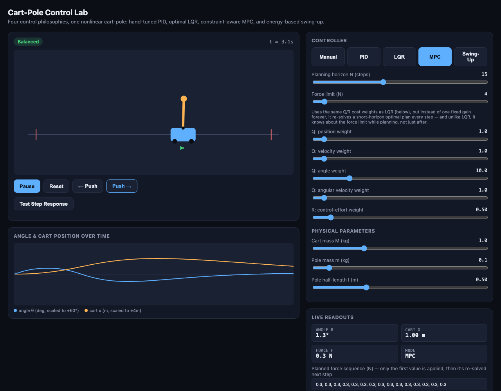
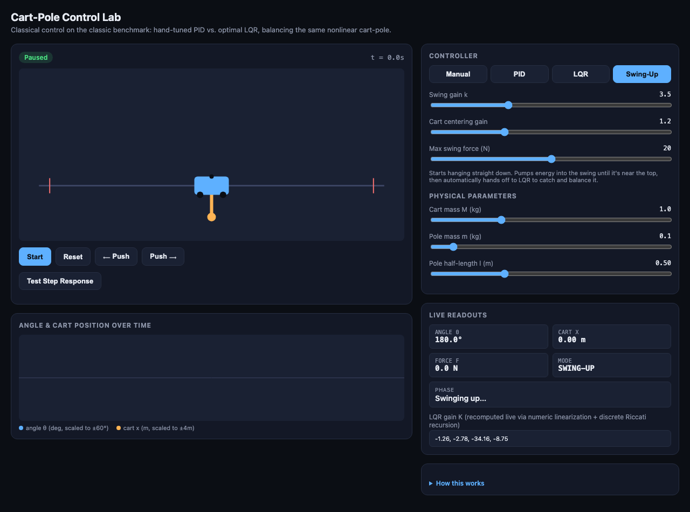
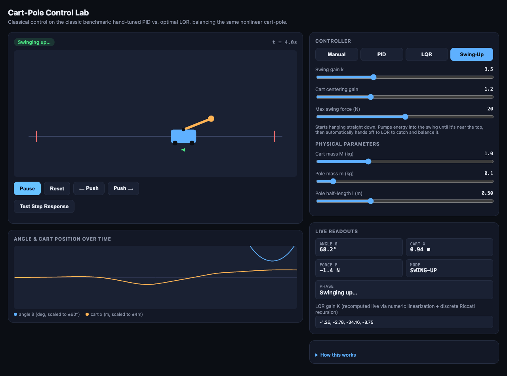
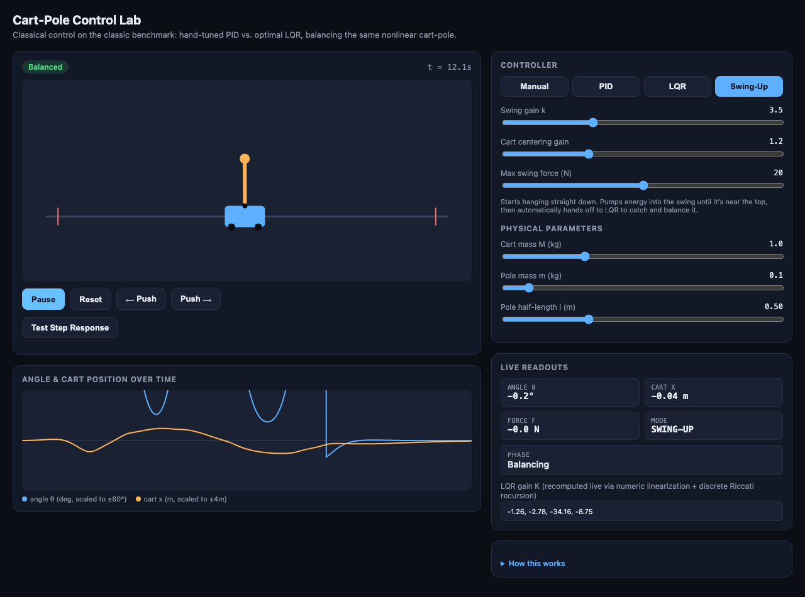

# Cart-Pole Control Lab

A hands-on control systems playground: balance the classic inverted-pendulum-on-a-cart with four genuinely different controllers — hand-tuned **PID**, optimal **LQR**, constraint-aware **MPC**, and energy-based **Swing-Up** — all computed live in your browser on the same nonlinear physics.

No install, no build step, no dependencies. It's a single HTML file — open it and it runs.



## How the pieces fit together

Every controller in this app is just a different way of turning the current state into a force. The physics doesn't care which one is plugged in:



Swing-up is really two controllers chained together with an automatic handoff:



## Quick start

1. Download or clone this repo.
2. Open `index.html` in any modern browser (double-click it, or drag it into a browser window).
3. Click **Start**.

That's it — the pole starts tilted very slightly and the default PID controller immediately begins balancing it.

## Step by step

### 1. Balance it with PID

The **PID** tab is selected by default. Click **Start** and watch the pole settle upright.

- **Push the pole** with the `⟵ Push` / `Push ⟶` buttons to disturb it and watch the controller recover.
- Drag the **Kp / Ki / Kd** sliders while it's running — higher `Kp` reacts to tilt more aggressively, `Kd` damps oscillation, `Ki` corrects any steady-state bias.
- Notice the **Kx / Kdx** sliders — these are what pull the cart itself back toward the center of the track. Turn them to `0` and push the pole: the *angle* still balances perfectly, but the cart slowly drifts off-track. That's not a bug — it's a real, well-known limitation of a naive PID design here (angle control and position control fight each other over the same actuator), and it's exactly the problem the next controller solves properly.



### 2. Switch to LQR

Click the **LQR** tab. Under the hood, the app:

1. Numerically linearizes the true nonlinear cart-pole equations around the upright position (via finite differences — it doesn't rely on a hand-derived formula).
2. Discretizes that linear model at the simulation's timestep.
3. Solves the discrete-time algebraic Riccati equation by iterating the backward Riccati recursion to convergence.
4. Produces a single gain vector **K** such that `F = -K · (state − equilibrium)` optimally balances *all four state variables at once* — cart position, cart velocity, pole angle, and pole angular velocity — trading off state error against control effort.

Push the pole exactly as hard as before. This time both the angle **and** the cart position recover together.

- The **Q** sliders weight how much the controller cares about each state variable being off-target (position, velocity, angle, angular velocity).
- The **R** slider weights how much it "costs" to use force at all — raise it and the controller gets gentler (and slower); lower it and it gets more aggressive.
- **K is recomputed live** every time you touch a Q/R slider or a physical parameter — watch the numbers in the "Live Readouts" panel change.



### 3. See what a force limit does — LQR vs. MPC

Click the **MPC** tab. Model Predictive Control uses the *same* linearized model and the *same* Q/R cost as LQR — but instead of computing one fixed gain forever, it re-solves a short optimization problem every single step ("given where I am right now, what's the best sequence of forces for the next N steps?"), applies only the first force, then throws the plan away and re-solves next step.

That alone wouldn't be very different from LQR — the two agree almost exactly when nothing is constrained. The real difference is the **Force limit** slider: MPC plans *knowing* that limit exists, while LQR would have to compute its ideal force and then get clipped after the fact. Try this:

1. Push the pole hard under **LQR** with the Q/R weights at their defaults — it recovers cleanly.
2. Switch to **MPC**, set **Force limit** to something tight like 3–5 N, and push equally hard.
3. Watch the **"Planned force sequence"** readout — you can see it budgeting a limited resource across the next several steps, not just slamming into a ceiling.



### 4. Swing it up from hanging down

Click the **Swing-Up** tab. This is a fourth, completely different control philosophy: instead of a linear correction near the upright equilibrium, it's **nonlinear energy-shaping control**, and it starts from the pole hanging straight down.



Click **Start**. The controller pumps energy into the pendulum's swing on every cycle — you'll see it rock back and forth with growing amplitude — until the angle and angular velocity are both small enough, at which point it automatically hands off to LQR to catch and hold it upright.





The **Swing gain** and **Cart centering gain** sliders control how aggressively it pumps energy and how hard it fights to keep the cart from wandering off the rail while doing so — turn the centering gain to 0 and watch the cart run away before ever reaching the top.

### 5. Try balancing it yourself

Click the **Manual** tab (previously "Off") and click **Start** — no controller is active. Click the page once so it has keyboard focus, then use **← / →** to push the cart yourself. Almost everyone loses it within a couple of seconds; it's a good visceral sense of why automatic control is worth having.

### 6. Measure the response quantitatively

With **PID** or **LQR** active and running, click **Test Step Response**. It applies a fixed angular disturbance and reports the **settling time** (how long until the angle stays within 2° continuously) and **peak overshoot** — the standard metrics control engineers use to compare tuning choices. Try it on PID and LQR back to back with their default gains: LQR isn't automatically "better" on every axis — it's optimal with respect to the cost you hand it (the Q/R weights), and the defaults here trade a slower, gentler response for lower control effort.

### 7. Experiment with the physics itself

The **Physical Parameters** sliders change the actual simulated system — cart mass, pole mass, pole length. Try making the pole much longer or the pole much heavier relative to the cart, then compare how much harder PID has to work versus how LQR, MPC, and swing-up just re-solve themselves automatically.

### 8. Read the chart

The strip chart below the simulation plots angle (blue) and cart position (orange) over a rolling 12-second window — useful for eyeballing overshoot, settling time, and oscillation as you retune gains. (During swing-up, angle briefly exceeds the chart's ±60° scale and draws off the top — that's expected; the chart is most informative once you're in the balancing phase.)

## How it works, in detail

### The physics

The simulation integrates the standard nonlinear, frictionless rigid-rod-on-cart model — a cart of mass `M` free to slide horizontally, with a uniform rod of mass `m` and half-length `l` pivoting on top of it. State is `[x, ẋ, θ, θ̇]` (cart position/velocity, pole angle/angular velocity from upright); the only input is a horizontal force `F` on the cart. The equations of motion:

```
temp      = (F + m·l·θ̇²·sinθ) / (M + m)
θ̈ (theta) = (g·sinθ − cosθ·temp) / (l·(4/3 − m·cos²θ/(M+m)))
ẍ (xddot) = temp − m·l·θ̈·cosθ / (M + m)
```

The `4/3` factor is the moment of inertia of a uniform rod about its pivot end (`(1/3)m l²` about its own center, plus `m l²` from the parallel-axis theorem for pivoting at the end, giving `(4/3)m l²`) — it's not an arbitrary constant, it falls straight out of treating the pole as a real rigid rod rather than a point mass on a string.

These are integrated with **RK4** (4th-order Runge-Kutta) at a fixed 0.01s timestep, sub-stepped independently of the animation frame rate via an accumulator pattern — so the simulation behaves identically regardless of your monitor's refresh rate, and stays numerically stable even under fast, aggressive control forces.

### PID

Standard three-term control on the angle, `F = Kp·θ + Ki·∫θ dt + Kd·θ̇`, plus a slower position-recovery term `+ Kx·x + Kdx·ẋ` so the cart doesn't drift off the track forever. Note there's no minus sign in front of any term — that's specific to this system's sign convention (positive force pushes the cart in +x, which happens to require a *positive* angle-proportional force to correct a *positive* tilt here), and it's exactly the kind of detail that's easy to get backwards from intuition alone. The integral term is clamped (anti-windup) to stop it accumulating without bound while the pole is still far from upright.

### LQR

1. **Linearize numerically.** Rather than hand-deriving a linear approximation of the equations above (easy to get subtly wrong), the app takes central finite differences of the *exact* nonlinear dynamics around the upright equilibrium, giving a 4×4 matrix `A` and a 4×1 matrix `B` such that `d(state)/dt ≈ A·state + B·F` near upright.
2. **Discretize.** `Ad = I + A·dt`, `Bd = B·dt` (Euler discretization at the simulation's own timestep — accurate enough since `dt` is small).
3. **Solve the discrete-time algebraic Riccati equation** by iterating its backward recursion to convergence, starting from `P = Q`:
   ```
   K  = (R + Bdᵀ·P·Bd)⁻¹ · (Bdᵀ·P·Ad)
   P' = Adᵀ·P·Ad − Adᵀ·P·Bd·K + Q
   ```
   Repeated ~300 times, this converges to the steady-state solution for any stabilizable system. Because there's only one control input, `R + Bdᵀ·P·Bd` is a scalar, so the "inverse" is just a division — no matrix inversion routine needed.
4. **Apply it.** `F = −K·(state − equilibrium)` — one formula, all four state variables, automatically balancing state error against control effort according to the `Q`/`R` weights you set.

### MPC

Uses the exact same linearized/discretized model (`Ad`, `Bd`) and cost weights (`Q`, `R`) as LQR, but instead of solving once for a steady-state gain, it solves a **finite-horizon** version fresh every step:

1. **Terminal cost = LQR's own `P` matrix.** This is the mathematically important trick: `P` is LQR's cost-to-go — the true cost of ending a trajectory in some state and running the optimal controller forever after. Using it as the cost of the *last* state in a short N-step plan means a short-horizon MPC problem and the infinite-horizon LQR problem agree almost exactly whenever nothing is constrained (an early version of this used a crude placeholder terminal cost instead, and the resulting controller was needlessly weak/myopic — using the real `P` fixed it immediately).
2. **Roll the plan forward** through the linear model for N steps, accumulating `x'Qx + Ru²` at each step, `x'Px` at the end.
3. **Optimize the force sequence** — projected gradient descent (finite-difference gradients, clamped to `[-Fmax, Fmax]` after every step) starting from last step's plan shifted by one (warm-starting), since re-solving from scratch every step would be wasteful and warm-starting converges in far fewer iterations.
4. **Apply only the first force**, discard the rest of the plan, and repeat next step — this "receding horizon" idea is the defining feature of MPC.

The force-limit constraint is enforced *during* optimization (candidate sequences are projected back into range after every gradient step), not applied afterward — that's what gives MPC a real, demonstrable edge over "compute the unconstrained optimum and clip it" once the limit gets tight.

*(A steep penalty for the cart approaching the track edge was tried too, as a way to give MPC a look-ahead advantage over LQR near a hard position limit — it made the simple gradient-descent optimizer numerically unstable and was dropped. Getting constrained optimization robustly right in general needs a proper QP solver; a plain projected-gradient shooting method is a reasonable, honestly-scoped middle ground for a dependency-free browser demo, but it isn't bulletproof against every kind of constraint.)*

### Swing-up

The pole's mechanical energy about the pivot, referenced so it's exactly zero at the upright target: `E = ½·I·θ̇² + m·g·l·(cosθ − 1)`, where `I = (4/3)m l²`. The control law `F = −k·θ̇·cosθ·(E_target − E) − Kc·x` pumps energy in on every swing until `E` approaches its target, with a small cart-centering term (`−Kc·x`) so the process doesn't walk the cart off the rail. Once the angle and angular velocity are both small, control switches to LQR.

This law's sign was **not** obvious from the usual textbook description — an early version pumped energy in the wrong direction and just damped the pendulum to a standstill at the bottom. It was found by numerically computing the exact `dE/dt` under `F = +10N` and `F = −10N` at several sample states and checking which sign of force actually increased energy, rather than trusting a remembered formula. The lesson generalizes: for anything nonlinear and coupled like this, a quick numerical check beats confidence in a derivation.

### Code layout

Everything — physics, a hand-rolled small-matrix library, the Riccati solver, the MPC shooting-method optimizer, energy/swing-up logic, response-time measurement, rendering, and UI — lives in `index.html` with no external dependencies. Top-to-bottom: `Physics → Linear algebra → LQR → MPC → Swing-up → Response test → Manual keyboard control → Simulation state → Rendering → Main loop → UI wiring`.

## Related projects

This is one of three linked projects exploring control, learning, and strategy:

- **[cartpole-rl](../cartpole-rl)** — the *same* cart-pole, balanced instead by a reinforcement-learning agent that starts with no model of the physics at all and learns purely from trial and error. Worth trying right after this one — LQR solves the system instantly with linear algebra; the RL agent needs thousands of episodes to reach a comparable policy.
- **[game-theory-lab](../game-theory-lab)** — a different flavor of strategic reasoning: the Iterated Prisoner's Dilemma and evolutionary game theory.
